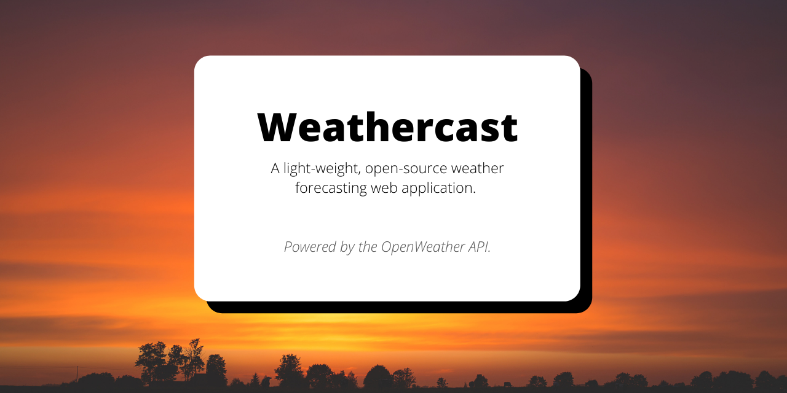
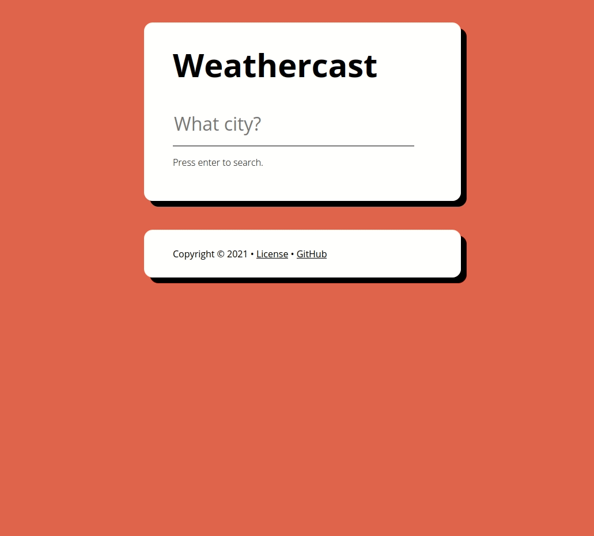

`weathercast` is a light-weight weather forecasting web application powered by the Openweather API. It allows users to query for weather data on virtually any particular city around globe.  

## Installation

[A live deployment of `weathercast` is available on GitHub Pages.](https://francislangit.github.io/weathercast/) Otherwise, for those that would like to locally use and/or edit the repository, follow the steps below:

1. Clone the repository with `git clone https://github.com/FrancisLangit/weathercast/` or download it as a `.zip` file.
2. Navigate to where the repository is saved on your local machine.
3. Use [`npm install`](https://docs.npmjs.com/cli/v7/commands/npm-install) to install the application's dependencies.
4. Open up `dist/index.html` on your preferred web browser to view and use the application.

## Usage

Users enter a search query of a city they'd like a weather forecast of. If the city exists, `weathercast` displays a wide array of weather data about the location queried. One is also given the ability to change the temperature scale displayed from Celsius to Fahrenheit and vice versa using the button on the top-right hand corner of the UI.

## Contributing

Feel free to submit an issue should a bug be found when utilizing the  application. One is also welcome to forward a pull request should they  seek to introduce a change.

## License

[MIT License](https://github.com/FrancisLangit/weathercast/blob/main/LICENSE)